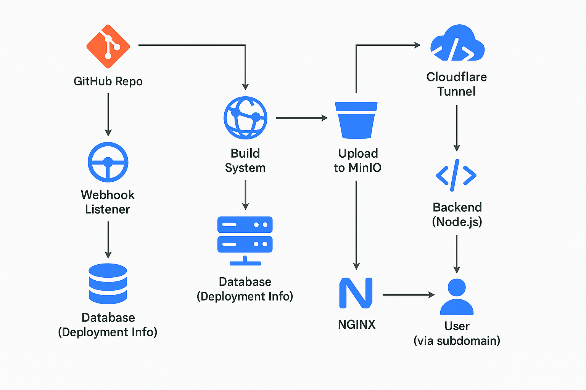

# Cloudpulse

# Pages:

## 📌 Overview

A centralized **Git-integrated static hosting platform** built to deploy and serve student projects and event websites through a CI/CD pipeline. It uses GitHub webhooks to automate builds, Docker for isolated deployments, and MinIO for object storage—all routed securely through NGINX and served with subdomain-based access.

## 🧩 Core Features

- GitHub integration (OAuth or token-based)
- Auto builds on `git push`
- Docker-based build system for SPAs/static sites
- MinIO object storage for deployed files
- NGINX reverse proxy with subdomain routing
- Preview deployments for pull requests
- Deployment logs and status in the frontend
- Custom domains (planned)
- Secure backend API for managing deployments

---

## ⚙️ Architecture

```java
   GitHub Repo
      |
      | (Webhook)
      v
[Webhook Listener] --> [Build System] --> [Upload to MinIO]
      |                                     |
      |                                     v
[Database (Deployment Info)]         [MinIO Bucket/Prefix]
      |                                     |
      v                                     v
[Backend (Node.js)] <--- NGINX <--- Cloudflare Tunnel <--- User (via subdomain)

```



---

## 🧪 Technologies Used

| Component | Tech Stack |
| --- | --- |
| CI/CD & Build | Docker, Bash, Node.js |
| Hosting Backend | Node.js + Express |
| Storage | MinIO (S3-compatible) |
| Proxy/Serving | NGINX |
| Frontend | Next.js or React.js |
| Domain Routing | Cloudflare + NGINX |
| Database | PostgreSQL / MongoDB |
| Git Integration | GitHub OAuth + Webhooks |
| Build Logs | File/DB logging, JSON |
| Authentication | GitHub OAuth or token |

## 🔄 Deployment Flow (Step-by-step)

### 1. **Project Setup**

- A **central GitHub organization** is created.
- Each student/project gets a **private repository** under this org.
- GitHub personal access token (with required scopes) is stored in backend.

### 2. **Webhook Setup**

- Webhook added to each repo (on push / PR events).
- Webhook URL points to your backend listener (`/api/webhook`).

### 3. **Webhook Listener**

- Verifies webhook signature.
- Extracts branch, repo, commit info.
- Logs the event and queues a build.

### 4. **Build System**

- Clones the repo.
- Uses a **Docker container** with builder tools (`npm`, `yarn`, `vite`, etc.).
- Builds the site (usually outputs to `/dist`, `/build`, etc.).
- Handles build failures and logs errors.

### 5. **Storage & CDN**

- Built output is uploaded to MinIO bucket, organized by:
    
    ```
    
    /<project_name>/<branch_name>/index.html
    ```
    
    `index.html` fallback is enabled for SPAs.
    
- Optional preview deployments use:
    
    ```
    
    /<project_name>/preview/<pr_id>/
    ```
    

### 6. **Reverse Proxy (NGINX)**

- Maps subdomains like:
    
    ```
    
    project.vijay.me --> /<project_name>/main/
    ```
    
    SPA fallback with `try_files $uri /index.html`.
    
- Served from MinIO via backend proxy route.

### 7. **Frontend Dashboard**

- Shows project status, logs, last deployment.
- Allows manual trigger of deployments.
- Displays preview URLs for PRs.
- (Planned) Analytics & visitor stats.

## 🔐 Authentication & Security

- Webhook signature verification.
- GitHub token stored securely in `.env` or secret manager.
- Access to private repos only for assigned collaborators.
- Subdomain access routed through Cloudflare Tunnel for HTTPS.
